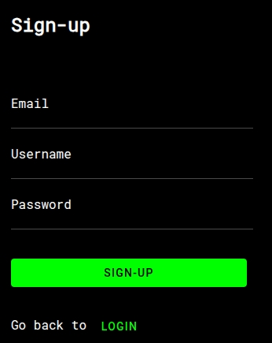
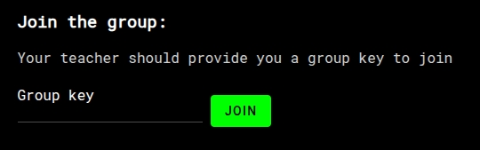
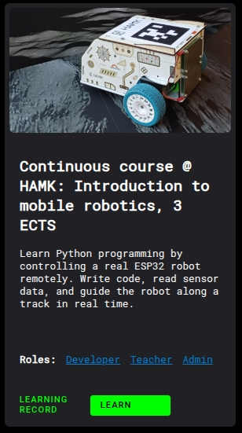
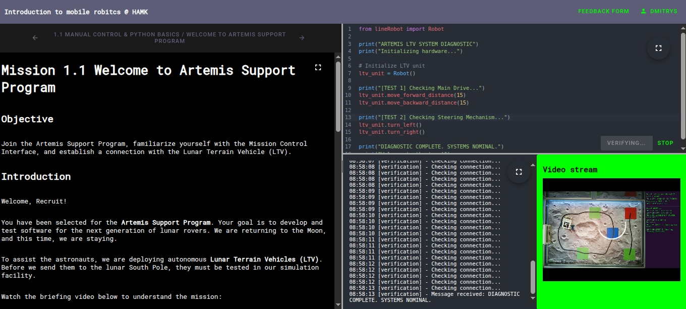

# Getting Started with the Robotics Remote Lab

Follow these steps to register, access the course, write code, and submit your assignment.

## Step 1. Create an Account

Visit the platform using this link  [hamk.ondroid.org](https://hamk.ondroid.org)  and click **Sign Up**.

Enter your username, email address, and password to create your account. We recommend that you use hamk email that you were given during the course enrollment so that we can link 
After registering, verify your email to activate your profile.

## Step 2. Enter Your Group Key

After logging in, enter your **Group Key**.  
This connects you to the course and unlocks access to the remote robots and learning materials.

**Group key for this course**

## Step 3. Start Learning

After the group key is accepted, open your dashboard and click **LEARN**.

This will take you to the **Continuous course @ HAMK: Introduction to mobile robotics, 3 ECTS** course.

---

# Platform Layout Overview

Inside the course interface the screen is divided into three main areas.

**Assignment Section**

Located on the left side.  
This panel shows the current assignment with instructions and learning goals.

**Code Editor**

Located in the upper right area.  
Here you write and edit the code that controls the robot.

**Terminal and Video Stream**

Located in the lower right area.

The terminal shows real time output from the robot.  
The video stream shows the robot moving so you can see how your code works.

---

# Run and Verify

Write your code in the **Code Editor**.

Click **Verify** to run the program.

If the code is correct the video window turns green and the robot performs the task.

If there is an error the window turns red.  
Check the **Terminal** and **Video recording** to see the error message and fix your code.

---

# Course progress

You can review your course progress on the **Learning Record** page. You can also access your last three assignments there.

---

# Need Help

## Discord channel

We keep our Discord channel open: https://discord.gg/McXvdwNr
If you run into any issues during the course, feel free to contact us there. You can also ask for hints if you get stuck on an assignment.

## Problems on the Coding Platform

Click **Feedback Form** next to your profile name in the top right corner.  
Describe the issue so the team can assist you.

